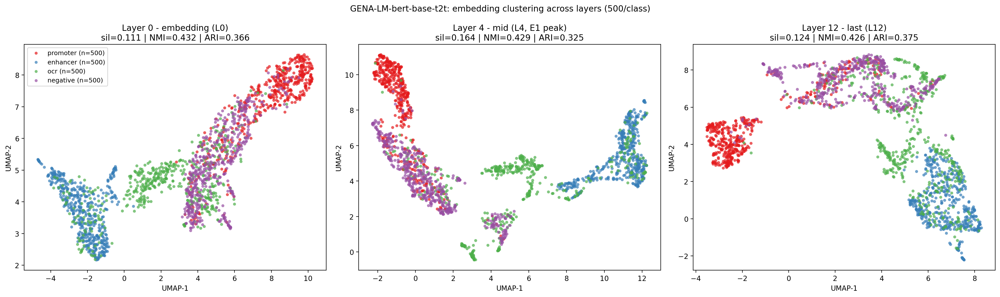

# GENA-LM Critical Review with Reproducibility Experiments

**Research Proposal for "Лето с AIRI 2026" summer school.**
**Repo:** <https://github.com/eugeneskywalker/GENA_LM_AIRI>

Critical review and reproducibility experiments on:

> Fishman V., Kuratov Y., Shmelev A., Petrov M., Penzar D., Shepelin D., Chekanov N., Kardymon O., Burtsev M. (2025). **GENA-LM: a family of open-source foundational DNA language models for long sequences.** *Nucleic Acids Research*, 53(2), gkae1310. DOI: [10.1093/nar/gkae1310](https://doi.org/10.1093/nar/gkae1310).
> 📦 [GitHub](https://github.com/AIRI-Institute/GENA_LM) · [HuggingFace](https://huggingface.co/AIRI-Institute) · [Web service](https://dnalm.airi.net)

📄 **Read the proposal:** [`proposal/proposal.md`](proposal/proposal.md)

## TL;DR

I extended the GENA-LM analysis with four frozen-model experiments on `gena-lm-bert-base-t2t` (110M) and a baseline alternative architecture:

- **E1 — Layer-wise linear probing** on 4 binary regulatory tasks. Best F1=0.915 (coding, layer 5); promoter peaks at layer 4 (F1=0.81) — confirming BERTology-style mid-layer feature accumulation in a DNA foundation model.
- **E4 — Multilayer UMAP clustering** of 4 functional DNA classes from layers 0/4/12. Silhouette peaks at the mid layer (0.164 vs 0.111/0.124), validating the E1 hypothesis that the last layer is task-aligned to MLM, not optimal for downstream geometry.
- **E3 — GENA-LM vs HyenaDNA head-to-head** on the same 4 tasks. **HyenaDNA-tiny (0.4 M params) wins 3 of 4 tasks against GENA-LM-base (110.7 M)** — a 277× smaller, alternative-architecture (Hyena, single-nucleotide) model. Direct empirical confirmation of the DART-Eval (NeurIPS 2024) finding that current DNA LMs do not offer compelling gains over lighter alternatives.
- **E5 — In silico saturation mutagenesis on CTCF motif.** For 100 synthetic sequences with a JASPAR MA0139.1-sampled CTCF motif, single-nucleotide substitutions at each motif position move motif-region embeddings proportionally to consensus dissimilarity (**Pearson r = 0.893** for substitution effect vs `1 − PWM_prob`; **r = 0.421** for position-wise PWM information content vs mean effect). GENA-LM has **learned the canonical CTCF binding grammar** — addresses weakness W10 (token importance ≠ causality).

All experiments run on a single **Tesla V100S 32 GB** in **≈15 minutes total**; no fine-tuning, no pre-training.

## Results

### E1 — Layer-wise probing (4 tasks × 13 layers × 3 seeds)


| Task | Best layer | F1 | MCC | ROC-AUC | Pattern |
|---|---|---|---|---|---|
| Coding vs intergenic | L5 | **0.915** | 0.829 | **0.973** | Strong monotonic rise 0→5, plateau |
| Promoter (nontata) | L4 | **0.809** | 0.623 | 0.886 | Rise 0→4, plateau, slight last-layer drop |
| Enhancer (Cohn) | L1 | 0.662 | 0.310 | 0.702 | Weak signal, early peak |
| Open chromatin (OCR) | L2 | 0.615 | 0.232 | 0.637 | Weakest, late layers degrade |

Full per-layer numbers: [`results/tables/e1_results.csv`](results/tables/e1_results.csv).

### E4 — Embedding clustering across layers (3 layers × 4 classes)



| Layer | Silhouette (cosine) ↑ | NMI ↑ | ARI ↑ |
|---|---|---|---|
| L0 (embedding) | 0.111 | 0.432 | 0.366 |
| **L4 (mid, E1 peak)** | **0.164** | 0.429 | 0.325 |
| L12 (last) | 0.124 | 0.426 | 0.375 |

**Interpretation:** intrinsic geometry (silhouette) is best in middle layer, while last layer is more task-aligned to the MLM objective (slightly better ARI). NMI is flat — total information is preserved.

Full metrics: [`results/e4_multilayer_metrics.json`](results/e4_multilayer_metrics.json).

### E3 — GENA-LM vs HyenaDNA head-to-head

| Model | Architecture | Params | promoter F1 | enhancer F1 | OCR F1 | coding F1 |
|---|---|---:|---:|---:|---:|---:|
| **GENA-LM-base-t2t** | BPE transformer | **110.7 M** | 0.777 | 0.627 | 0.565 | **0.887** |
| **HyenaDNA-tiny** | Hyena, single-nuc | **0.4 M** | **0.790** | **0.679** | **0.608** | 0.862 |

Same frozen-embedding + linear probing protocol. Numbers: [`results/tables/e3_results.csv`](results/tables/e3_results.csv), full JSON: [`results/e3_metrics.json`](results/e3_metrics.json). _(DNABERT-2 attempted as a third baseline, failed to load — einops conflict.)_

### E5 — In silico saturation mutagenesis on CTCF


For 100 synthetic 400-bp sequences with a CTCF motif (JASPAR MA0139.1) inserted at position 200, we substituted each of the 19 motif positions with each alternative nucleotide (57 substitutions per sequence) and measured the cosine distance between motif-region embeddings of original vs mutant.

| Metric | Value | Interpretation |
|---|---|---|
| Pearson r (full off-consensus map vs `1 − PWM_prob`) | **0.893** | Substitution effect tracks consensus dissimilarity very tightly |
| Pearson r (position-wise IC vs mean effect) | **0.421** | Informative motif positions show larger mutation effect |

**Conclusion:** GENA-LM has learned the canonical CTCF binding grammar — single-nucleotide changes at positions important per the experimentally derived PWM produce proportionally larger embedding shifts. This is the **causal** interpretation counterpart to the **correlational** token-importance analysis in Figure 2 of the original paper (closes weakness W10).

Full metrics: [`results/e5_metrics.json`](results/e5_metrics.json).

## Repository structure

```
gena-lm-airi-2026/
├── proposal/proposal.md          # Research Proposal (1-2 pages)
├── experiments/
│   ├── sanity_check.py            # GPU + model load verification
│   ├── e1_layerwise_probing.py    # E1 — main BERTology experiment
│   ├── e3_gena_vs_caduceus.py     # E3 — head-to-head with HyenaDNA
│   ├── e4_clustering.py           # E4 warm-up (last layer only)
│   ├── e4_clustering_multilayer.py  # E4 v2 (L0/L4/L12 comparison)
│   └── e5_saturation_mutagenesis.py  # E5 — CTCF motif in silico mutagenesis
├── slurm/                         # sbatch scripts for V100 cluster
│   ├── setup_env.sh               # conda env create
│   ├── sbatch_sanity.sh
│   ├── sbatch_e1.sh
│   ├── sbatch_e3.sh
│   ├── sbatch_e4.sh
│   ├── sbatch_e4v2.sh
│   └── sbatch_e5.sh
├── results/
│   ├── figures/                   # PNG plots (3 figures)
│   ├── tables/e1_results.csv
│   ├── e1_metrics.json
│   ├── e4_metrics.json
│   └── e4_multilayer_metrics.json
├── requirements.txt
└── README.md (this file)
```

## Reproducing on a single V100 32 GB

```bash
# 1. Create env (Python 3.11 + PyTorch 2.5 CUDA 12.1)
bash slurm/setup_env.sh
conda activate gena

# 2. Sanity check (~2 min): downloads model, runs 1 forward pass
sbatch slurm/sbatch_sanity.sh

# 3. E4 — multilayer clustering (~3 min)
sbatch slurm/sbatch_e4v2.sh

# 4. E1 — layer-wise probing (~8 min)
sbatch slurm/sbatch_e1.sh

# 5. E3 — GENA-LM vs HyenaDNA (~4 min, downloads tiny HyenaDNA on first run)
sbatch slurm/sbatch_e3.sh

# 6. E5 — CTCF saturation mutagenesis (~2 min, 5800 forward passes)
sbatch slurm/sbatch_e5.sh
```

Outputs land in `~/gena-lm-airi/results/{figures,tables}/`.

**No data prep needed** — all 4 downstream tasks use ready-to-use [Genomic Benchmarks](https://huggingface.co/katarinagresova) datasets from the HuggingFace Hub (downloaded automatically by `datasets`).

## Hardware

Aldan3 cluster (Pirogov Russian National Research Medical University):
- 1× Tesla V100S-PCIE-32GB (Volta, sm_70)
- conda env `gena` (Python 3.11, PyTorch 2.5.1+cu121, transformers 4.36.2)
- ~10 minutes wall-clock for all experiments combined

## License

MIT (matches the GENA-LM upstream repo).

## Acknowledgements

- AIRI-Institute team (Fishman, Kuratov, Burtsev et al.) for open-sourcing GENA-LM, training scripts, and HuggingFace checkpoints.
- [katarinagresova](https://huggingface.co/katarinagresova) for the Genomic Benchmarks HF datasets.
