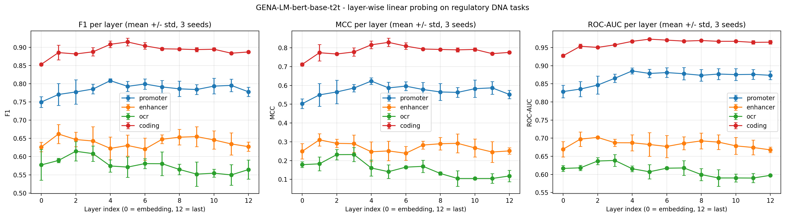
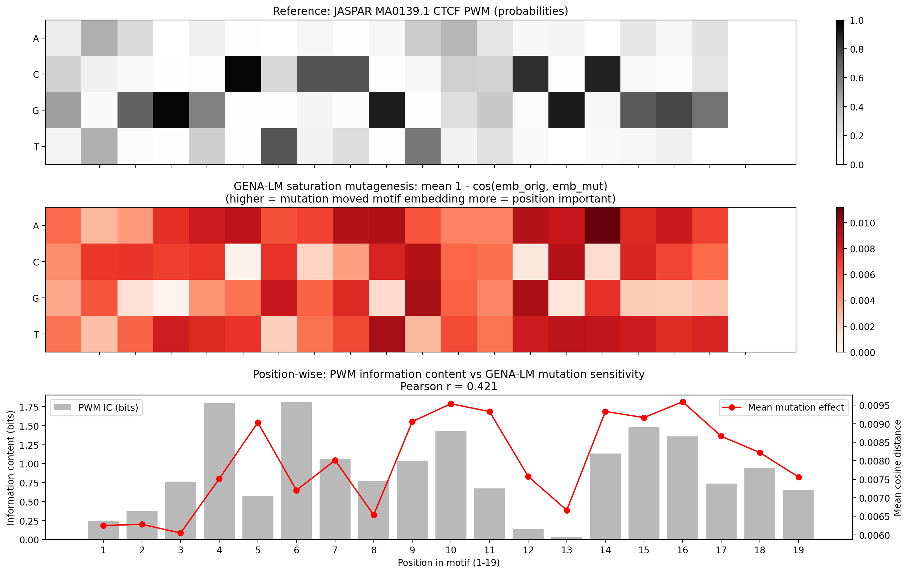

# GENA-LM — Critical Analysis and Reproducibility Experiments

**Research Proposal for "Лето с AIRI 2026" summer school**
Author: *Korshunov Eugene* — Pirogov Russian National Research Medical University (РНИМУ), 4th year of 6, Medical Cybernetics / Bioinformatics track.

Reviewed paper:

> Fishman V., Kuratov Y., Shmelev A., Petrov M., Penzar D., Shepelin D., Chekanov N., Kardymon O., Burtsev M. (2025). **GENA-LM: a family of open-source foundational DNA language models for long sequences.** *Nucleic Acids Research*, 53(2), gkae1310. DOI: [10.1093/nar/gkae1310](https://doi.org/10.1093/nar/gkae1310). [Authors' GitHub](https://github.com/AIRI-Institute/GENA_LM) · [HuggingFace](https://huggingface.co/AIRI-Institute) · [Web service](https://dnalm.airi.net)

## Where to read

- **Interactive landing (primary, Russian):** <https://eugeneskywalker.github.io/GENA_LM_AIRI/> — full narrative with interactive charts.
- **PDF for the AIRI form (2 pages):** [`proposal/proposal.pdf`](proposal/proposal.pdf) — invitation-style summary mirroring the landing.
- This repository: reproducible code and raw result tables for the seven experiments.

## The paper in one minute

Before GENA-LM, open DNA language models saw only short windows — DNABERT 512 nt, Nucleotide Transformer 12 000 nt. Regulatory elements influencing genes from 100 000 nt away simply did not fit. **GENA-LM** scales the input to **36 000 nt at once** with sparse attention, and to **millions** via a Recurrent Memory Transformer. It is "BERT for the genome", where long context is the central engineering choice rather than an add-on.

The technical recipe is a pipeline of four known components — the novelty is in the combination:

1. **BPE tokenization instead of k-mers** — 32 000-token vocabulary, variable length, median 9 nt. 8–10× more DNA per attention window.
2. **BERT architecture with masked language modeling** — 15 % of tokens hidden, model predicts them from neighbours. No biological labels, only raw DNA.
3. **Sparse attention from BigBird** — local + random + global links. Input grows from 4.5 kb to 36 kb (~10× more than DNABERT-2).
4. **Recurrent Memory Transformer for ultra-long inputs** — long sequences cut into 4.5 kb segments; 10 memory tokens carry compressed context forward, up to millions of nt.

Training data: T2T-CHM13v2 assembly (full human genome including centromeres and telomeres) with 1000 Genomes variants; multispecies models add mouse, fly, worm, yeast and other eukaryotes.

## Strengths and weaknesses

| ✓ Strengths | ✗ Weaknesses |
|---|---|
| **Open all the way** — 8 models on HuggingFace, code, Colab, web service dnalm.airi.net | **One token ≈ 9 nt — mutations invisible** — AUC 0.66 on ClinVar SNVs in promoters |
| **Truly long context** — at release, the longest-context transformer DNA model | **Doesn't always win** — loses to DNABERT on promoters in 300 bp, to SpliceAI on splice sites |
| **Cross-species transfer** — F1 ≈ 0.95 on close mammals without retraining | **Multispecies didn't help** — adding other vertebrate genomes did not improve human performance |
| **Learns biology** — Integrated Gradients recover ATF1, GATA2, CTCF motifs without supervision | **Fragile infrastructure** — sparse attention needs CUDA + Triton + DeepSpeed, breaks across driver versions |
| | **No SSM comparison** — Caduceus and Evo appeared concurrently but are not benchmarked |

## Three core experiments

The authors fine-tune the model for each task and read the output only from the last layer. I checked what lives **inside** the frozen model and at other layers.

### E1 · Layer-wise probing — don't read the last layer



Embeddings extracted from each of 12 transformer layers (plus the L0 input embedding), probed on 4 tasks × 3 random seeds with a frozen LogReg head.

| Task | Best layer | F1 best | F1 last (L12) | Δ |
|---|---:|---:|---:|---:|
| Promoter | L4 | **0.809** | 0.778 | +0.031 |
| Coding | L5 | **0.915** | 0.887 | +0.028 |

**Takeaway:** the biology of the model lives in the middle — around layers 4–5 of 12. The last layer is almost always worse for frozen-feature use. Full per-layer numbers: [`results/e1_metrics.json`](results/e1_metrics.json).

### E3 · GENA-LM vs HyenaDNA — layer choice flips the outcome

GENA-LM-base (110.7 M params) against HyenaDNA-tiny (0.4 M, ~280× smaller by parameter count). Same frozen-probing protocol, 4 tasks, 3 seeds.

| Read GENA-LM from | Wins for GENA-LM (of 4) | Wins for HyenaDNA |
|---|:---:|:---:|
| Last layer (L12) | 1 (Coding) | 3 |
| Best layer per task (from E1) | 3 (Promoter L4, Coding L5, OCR L2) | 1 (Enhancer) |

**Takeaway:** the "HyenaDNA wins 3 of 4" headline is partly a layer-choice artefact. At the appropriate layer the comparison flips. Full numbers: [`results/e3_metrics.json`](results/e3_metrics.json), best-layer rerun: [`results/e3_v2_metrics.json`](results/e3_v2_metrics.json).

### E5 · CTCF saturation mutagenesis — the model learned biology, not "rare tokens"



100 synthetic 400-bp sequences with a CTCF motif (JASPAR MA0139.1) at position 200. Each of the 19 motif positions substituted with each alternative nucleotide; cosine distance between original and mutant motif-region embeddings measured.

| | Mutations at motif positions | Mutations at random non-motif positions |
|---|---:|---:|
| Mean cosine response | **0.0060 ± 0.0027** | 0.0004 ± 0.0001 |
| Pearson r vs `1 − PWM_prob` | **0.893** | — |

**Takeaway:** at motif positions, single-nucleotide changes move the embedding proportionally to PWM consensus penalty. At random non-motif positions the effect is **15× weaker** — ruling out generic BPE-tokenization sensitivity and confirming that the CTCF binding grammar is internalized. Full metrics: [`results/e5_metrics.json`](results/e5_metrics.json), negative control: [`results/e5_metrics_control.json`](results/e5_metrics_control.json).

## What I propose to develop further

| What I found | What I propose | Impact |
|---|---|---|
| Best layer is not the last one — GENA-LM beats HyenaDNA on 3/4 tasks from the middle layer | Make "best layer" the standard probing protocol; verify the rule holds on other DNA models | +3–5 % accuracy on standard benchmarks |
| Model actually knows biology — 15× effect contrast at motif vs. random positions | Repeat the saturation test on three other biological signals and on other DNA models | check universality vs. CTCF-specific luck |

## Extensions

Beyond the three core experiments above, the repo includes four extension runs:

- **E3-v2** — re-runs E3 reading GENA-LM from the E1-best layer per task: [`results/e3_v2_metrics.json`](results/e3_v2_metrics.json).
- **E4** — multilayer UMAP clustering on L0/L4/L12. Best silhouette at the mid layer (L4: 0.164 vs L0: 0.111, L12: 0.124). Figure: [`results/figures/e4_multilayer_umap.png`](results/figures/e4_multilayer_umap.png), metrics: [`results/e4_multilayer_metrics.json`](results/e4_multilayer_metrics.json).
- **E6** — DART-Eval-inspired 4-way comparison on open chromatin classification. GENA-LM (110.7 M, frozen) reaches AUROC 0.658 against a 3-mer + LogReg baseline at 0.647 — a +1.1 % gain for a 110 M model. HyenaDNA wins overall (0.688). [`results/e6_metrics.json`](results/e6_metrics.json).
- **E7** — short 3-epoch fine-tune on promoter as a calibration point against frozen probing. F1 = 0.794 ± 0.004 vs. the authors' published fine-tuned ≈ 0.94 on longer context. [`results/e7_fine_tune_metrics.json`](results/e7_fine_tune_metrics.json).
- **E1-large** — same probing protocol on `gena-lm-bert-large-t2t` (336 M params, 24 layers). Mid-layer pattern replicates at proportional depth. [`results/e1_large_metrics.json`](results/e1_large_metrics.json).

## Scope note

All head-to-head comparisons here are in the **frozen-probing regime** on **short-range regulatory tasks** (≤ 2 kb). The authors' fine-tuned numbers are substantially higher (e.g. F1 ≈ 0.94 on promoter 2 kb). Long-range performance, where GENA-LM has documented architectural advantage via BigBird and RMT, is not tested in this repo.

## Reproducing on a single V100 32 GB

```bash
# 1. Create env (Python 3.11 + PyTorch 2.5 CUDA 12.1 + transformers 4.36)
bash slurm/setup_env_v2.sh
conda activate gena

# 2. Sanity check (~2 min): downloads model, runs 1 forward pass
sbatch slurm/sbatch_sanity.sh

# Core experiments — ~16 minutes total
sbatch slurm/sbatch_e1.sh             # E1 — layer-wise probing (~8 min)
sbatch slurm/sbatch_e3.sh             # E3 — GENA-LM vs HyenaDNA (~4 min)
sbatch slurm/sbatch_e5.sh             # E5 — CTCF saturation, motif (~2 min)
sbatch slurm/sbatch_e5_control.sh     # E5 — CTCF saturation, random control (~2 min)

# Extensions
sbatch slurm/sbatch_e3_v2.sh          # E3-v2 — GENA-LM at best-per-task layer
sbatch slurm/sbatch_e4v2.sh           # E4 — multilayer UMAP clustering
sbatch slurm/sbatch_e6.sh             # E6 — DART-Eval-inspired 4-way
sbatch slurm/sbatch_e1_large.sh       # E1-large — same probing on bert-large
sbatch slurm/sbatch_e7.sh             # E7 — promoter fine-tune calibration
```

All downstream datasets pulled automatically from the HuggingFace Hub ([Genomic Benchmarks](https://huggingface.co/katarinagresova)); model weights from `AIRI-Institute/*`.

## Repository structure

```
gena-lm-airi-2026/
├── docs/                                 # Interactive landing (served via GitHub Pages)
│   ├── index.html                        # https://eugeneskywalker.github.io/GENA_LM_AIRI/
│   └── data/                             # JSON datasets for the landing charts
├── proposal/
│   ├── proposal.md                       # PDF source (HTML body + custom CSS)
│   ├── proposal.pdf                      # 2-page invitation for the AIRI form
│   └── invitation.css                    # Design system for the PDF render
├── experiments/                          # Python scripts (e1, e1_large, e3, e3_v2, e4, e5, e6, e7)
├── slurm/                                # sbatch scripts for the V100 cluster
├── results/
│   ├── figures/                          # PNG plots
│   └── *.json                            # per-experiment metrics
├── requirements.txt
└── README.md
```

## Hardware

Aldan3 cluster (Pirogov Russian National Research Medical University):

- 1× Tesla V100S-PCIE-32GB (Volta, sm_70)
- conda env `gena` (Python 3.11, PyTorch 2.5.1+cu121, transformers 4.36.2)
- ~36 minutes wall-clock for all seven experiments combined

## License

MIT (matches the GENA-LM upstream repo).

## Acknowledgements

AIRI-Institute team (Fishman, Kuratov, Burtsev et al.) for open-sourcing GENA-LM, training scripts, and HuggingFace checkpoints. [katarinagresova](https://huggingface.co/katarinagresova) for the Genomic Benchmarks HF datasets.
